# Anforderungsanalyse

---

## Dokumentdaten

### Übersicht

**Projekt**: Projekt Episkos \
&nbsp;&nbsp;&nbsp;&nbsp;_Iteration_: 0 \
&nbsp;&nbsp;&nbsp;&nbsp;_Arbeitspaket_: Anforderungsanalyse \
**Autor**: Simon Blum \
**Datum**: 13.11.2024 \
**Zuletzt geändert**: \
&nbsp;&nbsp;&nbsp;&nbsp;_von_: Paul Stöckle \
&nbsp;&nbsp;&nbsp;&nbsp;_am_: 15.11.2024 \
**Version**: 6 \
**Prüfer**: Paul Stöckle \
**Letzte Freigabe**: \
&nbsp;&nbsp;&nbsp;&nbsp;_durch_: Max Rodler \
&nbsp;&nbsp;&nbsp;&nbsp;_am_: 15.11.2024

### Changelog

| Datum      | Verfasser    | Kurzbeschreibung                             |
| ---------- | ------------ | -------------------------------------------- |
| 13.11.2024 | Simon Blum   | Initialer Meeting-Mitschrieb                 |
| 13.11.2024 | Ben Oeckl    | Ergänzung von Requirements in Use Cases      |
| 13.11.2024 | Paul Stöckle | Überarbeitung von Requirements               |
| 15.11.2024 | Paul Stöckle | Hinzufügen des Headers                       |
| 15.11.2024 | Max Rodler   | Fehlerbehebung                               |
| 21.11.2024 | Simon Blum   | Aktualisierung von UseCases und Requirements |

### Distribution List

- Simon Blum <simon21.blum@gmail.com>
- Ben Oeckl <ben@oeckl.com>
- Maximilian Rodler <maximilianreinerrodler@gmail.com>
- Paul Stöckle <paul.stoeckle@t-online.de>

---

## UseCases

### Erläuterung Pakete

Die UseCases sind in 3 Pakete aufgeteilt.

#### Paket 1 - Create, Read, Update, Delete

Bei den UseCases in Paket 1 geht es primäre um die atomare manipulation von
Daten.

#### Paket 2 - Manifest interaktion

Bei den UseCases in Paket 2 geht es vor allem um die Interaktionen mit dem
lokalen Dateisystem und sich dort befindende Manifestdateien

#### Paket 3 - Funktionalitäten

Paket 3 umfasst UseCases welche erweiterte Funktionalitäten des Systems darstellen.

### UC1.1 Anwendung starten

|                                 | Iteration |                                                            |
| ------------------------------- | --------- | ---------------------------------------------------------- |
| Id                              | 1         | UC1.1                                                      |
| Paket                           | 2         | 1                                                          |
| Autor                           | 1         |                                                            |
| Version                         | 1         | 4                                                          |
| Kurzbeschreibung                | 1         | Der Nutzer kann die Anwendung starten                      |
| Beteiligte Akteure              | 1         | Nutzer                                                     |
| Fachverantwortlicher            | 1         |                                                            |
| Referenzen                      | 2         |                                                            |
| Vorbedingungen                  | 2         | Die Anwendung ist auf einem kompatiblen System installiert |
| Nachbedingungen                 | 2         | Die Anwendung ist gestartet und nutzungsbereit             |
| Typischer Ablauf                | 2         | s. Ablaufdiagramm                                          |
| Alternative Abläufe             | 3         | -                                                          |
| Kritikalität                    | 3         | 0                                                          |
| Verknüpfungen                   | 2         | UC2.1, U2.2                                                |
| Funktionale Anforderungen       | 4         | FA1.1.1, FA1.1.2, FA2.1.5, FA2.2.5                         |
| Nicht-funktionale Anforderungen | 4         | NA2                                                        |

#### UC1.1 UseCase Diagramm

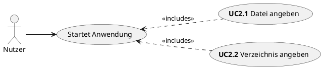

#### UC1.1 Ablaufdiagramm

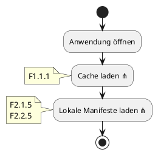

### UC1.2 Metadaten anlegen

| Metadaten anlegen               | Iteration |                                                                                                                                                     |
| ------------------------------- | --------- | --------------------------------------------------------------------------------------------------------------------------------------------------- |
| Id                              | 1         | UC1.2                                                                                                                                               |
| Paket                           | 2         | P1                                                                                                                                                  |
| Autor                           | 1         |                                                                                                                                                     |
| Version                         | 1         | 5                                                                                                                                                   |
| Kurzbeschreibung                | 1         | Der Nutzer kann mithilfe der Anwendung oder manuelle eine Manifestdatei mit Metadaten erstellen                                                     |
| Beteiligte Akteure              | 1         | Nutzer                                                                                                                                              |
| Fachverantwortlicher            | 1         |                                                                                                                                                     |
| Referenzen                      | 2         | Dateiformat Doku                                                                                                                                    |
| Vorbedingungen                  | 2         | Es muss ein Verzeichnis für das Projekt existieren , in dem sich keine andere Manifestdatei befindet                                                |
| Nachbedingungen                 | 2         | Es existiert eine Manifestdatei in dem gewählten Ordner. Wurde das Projekt über die Anwendung erstellt, wurden die Daten in der Datenbank gecached. |
| Typischer Ablauf                | 2         | s. Ablaufdiagramm                                                                                                                                   |
| Alternative Abläufe             | 3         | s. Ablaufdiagramm                                                                                                                                   |
| Kritikalität                    | 3         | 0                                                                                                                                                   |
| Verknüpfungen                   | 2         |                                                                                                                                                     |
| Funktionale Anforderungen       | 4         | FA1.2.1, FA1.2.2, FA1.2.3                                                                                                                           |
| Nicht-funktionale Anforderungen | 4         |                                                                                                                                                     |

#### UC1.2 UseCase Diagramm

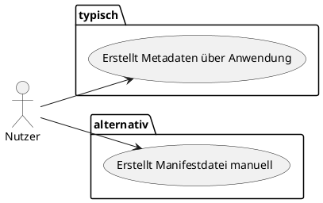

#### UC1.2 Ablaufdiagramme

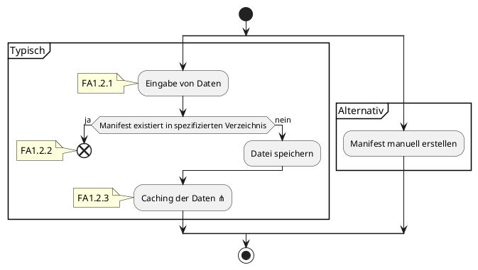

### UC1.3 Metadaten bearbeiten

| Schritt                         | Iteration |                                                                                                                             |
| ------------------------------- | --------- | --------------------------------------------------------------------------------------------------------------------------- |
| Id                              | 1         | UC1.3                                                                                                                       |
| Paket                           | 2         | P1                                                                                                                          |
| Autor                           | 1         |                                                                                                                             |
| Version                         | 1         | 5                                                                                                                           |
| Kurzbeschreibung                | 1         | Der Nutzer kann die Metadaten eines Projektes über die Anwendung oder manuell in der Datei bearbeiten.                      |
| Beteiligte Akteure              | 1         | Nutzer                                                                                                                      |
| Fachverantwortlicher            | 1         |                                                                                                                             |
| Referenzen                      | 2         | Dateiformat Doku                                                                                                            |
| Vorbedingungen                  | 2         | Es muss eine Manifestdatei existieren die bearbeitet werden kann.                                                           |
| Nachbedingungen                 | 2         | Die angepasste Manifestdatei wird gespeichert. Wurde die Datei über die Anwendung geändert, werden die Änderungen gecached. |
| Typischer Ablauf                | 2         | s. Ablaufdiagramm                                                                                                           |
| Alternative Abläufe             | 3         | s. Ablaufdiagramm                                                                                                           |
| Kritikalität                    | 3         | 1                                                                                                                           |
| Verknüpfungen                   | 2         |                                                                                                                             |
| Funktionale Anforderungen       | 4         | FA1.3.1, FA1.3.2, FA1.3.3                                                                                                   |
| Nicht-funktionale Anforderungen | 4         |                                                                                                                             |

#### UC1.3 UseCase Diagramm

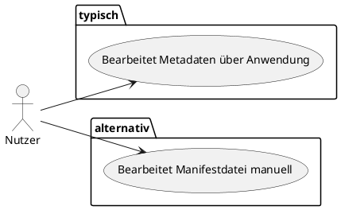

#### UC1.3 Ablaufdiagramme

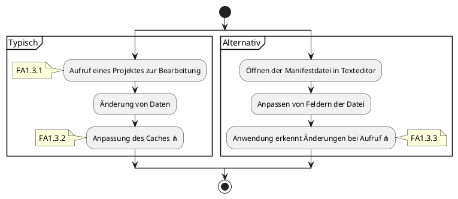

### UC1.4 Metadaten löschen

| Schritt                         | Iteration |                                                                                                                                               |
| ------------------------------- | --------- | --------------------------------------------------------------------------------------------------------------------------------------------- |
| Id                              | 1         | UC1.4                                                                                                                                         |
| Paket                           | 2         | P1                                                                                                                                            |
| Autor                           | 1         |                                                                                                                                               |
| Version                         | 1         | 5                                                                                                                                             |
| Kurzbeschreibung                | 1         | Der Nutzer kann die Metadaten für ein Projekt löschen                                                                                         |
| Beteiligte Akteure              | 1         | Nutzer                                                                                                                                        |
| Fachverantwortlicher            | 1         |                                                                                                                                               |
| Referenzen                      | 2         |                                                                                                                                               |
| Vorbedingungen                  | 2         | Es existiert eine valide Manifestdatei die gelöscht werden kann                                                                               |
| Nachbedingungen                 | 2         | Es existiert keine Manifestdatei mehr. Bei manueller Löschung wird der Cache im nachhinein, beim nächsten Starten der Anwendung aktualisiert. |
| Typischer Ablauf                | 2         | s. Ablaufdiagramm                                                                                                                             |
| Alternative Abläufe             | 3         | s. Ablaufdiagramm                                                                                                                             |
| Kritikalität                    | 3         | 1                                                                                                                                             |
| Verknüpfungen                   | 2         | Beim löschen über die Anwendung UseCase 3.1                                                                                                   |
| Funktionale Anforderungen       | 4         | FA1.4.1, FA1.4.2, FA1.4.3                                                                                                                     |
| Nicht-funktionale Anforderungen | 4         |                                                                                                                                               |

#### UC1.4 UseCase Diagramm

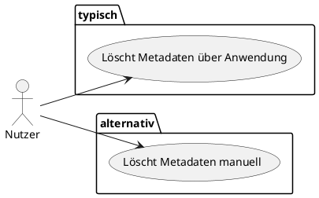

#### UC1.4 Ablaufdiagramme

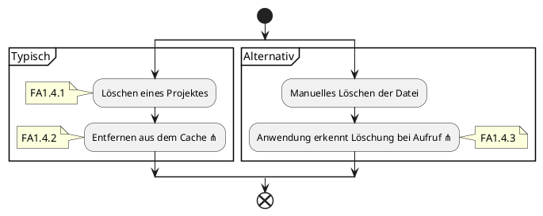

### UC2.1 Datei angeben

|                                 | Iteration |                                                                                                                                                                                                            |
| ------------------------------- | --------- | ---------------------------------------------------------------------------------------------------------------------------------------------------------------------------------------------------------- |
| Id                              | 1         | UC2.1                                                                                                                                                                                                      |
| Paket                           | 2         | 2                                                                                                                                                                                                          |
| Autor                           | 1         |                                                                                                                                                                                                            |
| Version                         | 1         | 4                                                                                                                                                                                                          |
| Kurzbeschreibung                | 1         | Der Nutzer kann den Pfad zu einer Manifestdatei angeben, welche dann deserialisiert wird. Der Pfad der Datei kann gespeichert werden und beim nächsten Starten der Anwendung erneut deserialisiert werden. |
| Beteiligte Akteure              | 1         | Nutzer                                                                                                                                                                                                     |
| Fachverantwortlicher            | 1         |                                                                                                                                                                                                            |
| Referenzen                      | 2         | -                                                                                                                                                                                                          |
| Vorbedingungen                  | 2         | Es existiert eine valide Manifestdatei welche der Nutzer angeben kann.                                                                                                                                     |
| Nachbedingungen                 | 2         | Die Datei wurde deserialisiert und die Daten können weiterverarbeitet werden.                                                                                                                              |
| Typischer Ablauf                | 2         | s. Ablaufdiagramm                                                                                                                                                                                          |
| Alternative Abläufe             | 3         | -                                                                                                                                                                                                          |
| Kritikalität                    | 3         | 0                                                                                                                                                                                                          |
| Verknüpfungen                   | 2         | U1.1                                                                                                                                                                                                       |
| Funktionale Anforderungen       | 4         | FA2.1.1, FA2.1.2, FA2.1.3, FA2.1.4, FA2.1.5                                                                                                                                                                |
| Nicht-funktionale Anforderungen | 4         |                                                                                                                                                                                                            |

#### UC2.1 UseCase Diagramm

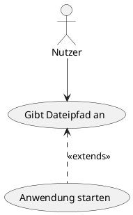

#### UC2.1 Ablaufdiagramm

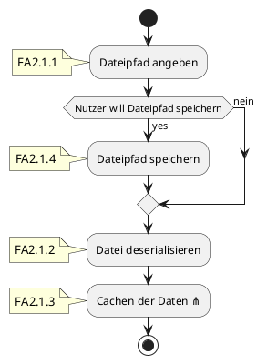

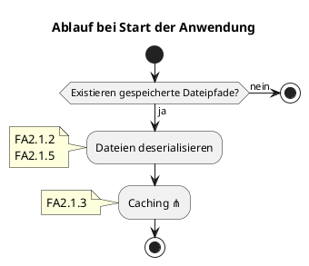

### UC2.2 Verzeichnis angeben

|                                 | Iteration |                                                                                                                                                                                                     |
| ------------------------------- | --------- | --------------------------------------------------------------------------------------------------------------------------------------------------------------------------------------------------- |
| Id                              | 1         | UC2.2                                                                                                                                                                                               |
| Paket                           | 2         | 2                                                                                                                                                                                                   |
| Autor                           | 1         |                                                                                                                                                                                                     |
| Version                         | 1         | 4                                                                                                                                                                                                   |
| Kurzbeschreibung                | 1         | Der Nutzer kann einen Pfad angeben, welcher rekursiv nach Manifesten durchsucht wird. Angegebene Pade können gespeichert werden und beim nächsten Ausführen der Anwendung wieder durchsucht werden. |
| Beteiligte Akteure              | 1         | Nutzer                                                                                                                                                                                              |
| Fachverantwortlicher            | 1         |                                                                                                                                                                                                     |
| Referenzen                      | 2         |                                                                                                                                                                                                     |
| Vorbedingungen                  | 2         | Es existiert ein Verzeichnis welches der Nutzer angeben kann.                                                                                                                                       |
| Nachbedingungen                 | 2         | Wenn in dem Verzeichnis Manifeste liegen, wurden diese deserialisiert.                                                                                                                              |
| Typischer Ablauf                | 2         | s. Ablaufdiagramm                                                                                                                                                                                   |
| Alternative Abläufe             | 3         | s. Ablaufdiagramm                                                                                                                                                                                   |
| Kritikalität                    | 3         |                                                                                                                                                                                                     |
| Verknüpfungen                   | 2         | U1.1                                                                                                                                                                                                |
| Funktionale Anforderungen       | 4         | FA2.2.1, FA2.2.2, FA2.2.3, FA2.2.4, FA2.2.5                                                                                                                                                         |
| Nicht-funktionale Anforderungen | 4         |                                                                                                                                                                                                     |

#### UC2.2 UseCase Diagramm

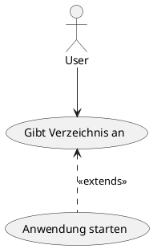

#### UC2.2 Ablaufdiagramm

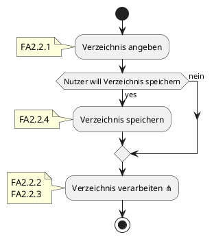

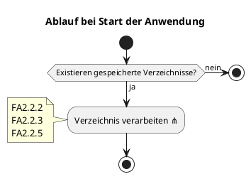

### UC3.1 Projekte suchen

| Schritt                         | Iteration |                                                                                       |
| ------------------------------- | --------- | ------------------------------------------------------------------------------------- |
| Id                              | 1         | UC3.1                                                                                 |
| Paket                           | 2         | P3                                                                                    |
| Autor                           | 1         |                                                                                       |
| Version                         | 1         | 6                                                                                     |
| Kurzbeschreibung                | 1         | Der Nutzer kann seine Projekte nach verschiedenen Eigenschaften durchsuchen           |
| Beteiligte Akteure              | 1         | Nutzer                                                                                |
| Fachverantwortlicher            | 1         |                                                                                       |
| Referenzen                      | 2         |                                                                                       |
| Vorbedingungen                  | 2         | Die Anwendung ist gestartet und gecachete und lokale Daten wurden geladen.            |
| Nachbedingungen                 | 2         | Dem Nutzer werden die Projekte angezeigt, die den gegebenen Eigenschaften entsprechen |
| Typischer Ablauf                | 2         | s. Ablaufdiagramm                                                                     |
| Alternative Abläufe             | 3         | -                                                                                     |
| Kritikalität                    | 3         | 3                                                                                     |
| Verknüpfungen                   | 2         | -                                                                                     |
| Funktionale Anforderungen       | 4         | FA3.1.1, FA3.1.2, FA3.1.3                                                             |
| Nicht-funktionale Anforderungen | 4         |                                                                                       |

#### UC3.1 UseCase Diagramm

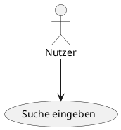

#### UC3.1 Ablaufdiagramm

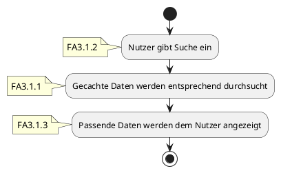

### UC3.2 Projekte filtern

| Schritt                         | Iteration |                                                                                   |
| ------------------------------- | --------- | --------------------------------------------------------------------------------- |
| Id                              | 1         | UC3.2                                                                             |
| Paket                           | 2         | P3                                                                                |
| Autor                           | 1         |                                                                                   |
| Version                         | 1         | 6                                                                                 |
| Kurzbeschreibung                | 1         | Der Nutzer kann seine Projekte nach verschiedenen Kriterien filtern               |
| Beteiligte Akteure              | 1         | Nutzer                                                                            |
| Fachverantwortlicher            | 1         |                                                                                   |
| Referenzen                      | 2         |                                                                                   |
| Vorbedingungen                  | 2         | Die Anwendung ist gestartet und gecachete und lokale Daten wurden geladen.        |
| Nachbedingungen                 | 2         | Dem Nutzer werden die Projekte angezeigt, die den gegebenen Kriterien entsprechen |
| Typischer Ablauf                | 2         | s. Ablaufdiagramm                                                                 |
| Alternative Abläufe             | 3         | -                                                                                 |
| Kritikalität                    | 3         | 3                                                                                 |
| Verknüpfungen                   | 2         | -                                                                                 |
| Funktionale Anforderungen       | 4         | FA3.2.1, FA3.2.2, FA3.2.3                                                         |
| Nicht-funktionale Anforderungen | 4         |                                                                                   |

#### UC3.2 UseCase Diagramm

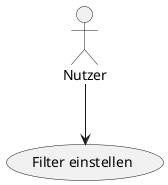

#### UC3.2 Ablaufdiagramm

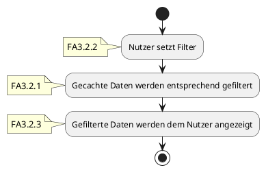

### UC3.3 Statistiken

| Schritt                         | Iteration |                                                                                                                         |
| ------------------------------- | --------- | ----------------------------------------------------------------------------------------------------------------------- |
| Id                              | 1         | UC3.3                                                                                                                   |
| Paket                           | 2         | P3                                                                                                                      |
| Autor                           | 1         |                                                                                                                         |
| Version                         | 1         | 5                                                                                                                       |
| Kurzbeschreibung                | 1         | Dem Nutzer werden in der graphischen Anwendung verschiedene Statistiken und Analysen zu seinen Projekten bereitgestellt |
| Beteiligte Akteure              | 1         | Nutzer                                                                                                                  |
| Fachverantwortlicher            | 1         |                                                                                                                         |
| Referenzen                      | 2         |                                                                                                                         |
| Vorbedingungen                  | 2         | Die Anwendung ist gestartet und gecachete und lokale Daten wurden geladen.                                              |
| Nachbedingungen                 | 2         | Der Nutzer kann die bereitgestellten Statistiken in der graphischen Anwendung einsehen                                  |
| Typischer Ablauf                | 2         | s. Ablaufdiagramm                                                                                                       |
| Alternative Abläufe             | 3         | -                                                                                                                       |
| Kritikalität                    | 3         | 3                                                                                                                       |
| Verknüpfungen                   | 2         |                                                                                                                         |
| Funktionale Anforderungen       | 4         | FA3.3.1, FA3.3.2                                                                                                        |
| Nicht-funktionale Anforderungen | 4         |                                                                                                                         |

#### UC3.3 UseCase Diagramm

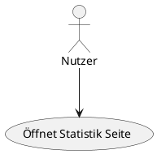

#### UC3.3 Ablaufdiagramm

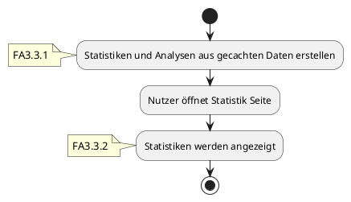

## Anforderungen

### Funktionale Anforderungen

FA1.1.1 Beim Starten soll das System gecachte Daten laden.

FA1.1.2: Das System muss Manifestdateien aus dem lokalen Datensystem deserialiseren.

FA1.2.1 Das System muss dem Nutzer die Möglichkeit bieten eine Manifestdatei mit Metadaten zu erstellen.

FA1.2.2 Beim Erstellen muss das System prüfen, ob in dem relevanten Verzeichnis bereits eine Manifestdatei existiert.

FA1.2.3 Nach Erstellen soll das System die Metadaten im Cache speichern.

FA1.3.1 Das System soll dem Nutzer die Möglichkeit bieten Metadaten anzupassen.

FA1.3.2 Bei Änderungen soll das System relevante Metadaten automatisch im Cache aktualisieren.

FA1.3.3 Bei manuellen Änderungen an der Datei muss das System diese erkennen und dementsprechende Anpassungen im Cache
vornehmen.

FA1.4.1 Das System muss dem Nutzer die Möglichkeit bieten Metadaten zu löschen.

FA1.4.2 Bei Löschung soll das System die relevanten Daten automatisch aus dem Cache entfernen.

FA1.4.3 Bei manueller Löschung muss das System dies erkennen und den relevanten Eintrag aus dem Cache entfernen.

FA2.1.1 Das System muss dem Nutzer die Möglichkeit bieten den Pfad zu einer einzelnen Manifestdatei anzugeben.

FA2.1.2 Gibt der Nutzer den Pfad zu einer valide Datei ein, muss das System in der Lage sein diese zu deserialisieren.

FA2.1.3 Nach der Deserialisierung soll das System die Daten im Cache speichern.

FA2.1.4 Das System soll dem Nutzer die Möglichkeit bieten Dateipfade für zukünftiges deserialisieren zu speichern.

FA2.1.5 Wenn gespeicherte Dateipfade existieren soll, das System beim Starten diese automatisch deserialisieren.

FA2.2.1 Das System soll dem Nutzer die Möglichkeit bieten ein Verzeichnis anzugeben, welches rekursiv nach
Manifestdateien durchsucht wird.

FA2.2.2 Wenn in diesem Verzeichnis Manifeste existieren soll das System diese serialisieren.

FA2.2.3 Wenn das System ein Manifest aus einem Verzeichnis serialisiert hat, soll es bei Abweichungen den Cache
aktualisieren.

FA2.2.4 Das System soll dem Nutzer die Möglichkeit bieten Verzeichnisse für zukünftiges durchsuchen zu speichern.

FA2.2.5 Wenn gespeicherte Verzeichnisse existieren, soll das System beim Starten diese automatisch durchsuchen.

FA3.1.1 Das System soll gecachte Metadaten auf verschiedene Eigenschaften durchsuchen können.

FA3.1.2 Das System soll dem Nutzer die Möglichkeit bieten die Suche anzupassen.

FA3.1.3 Das System soll dem Nutzer die Möglichkeit bieten auf Suchergebnisse zugreifen zu können.

FA3.2.1 Das System soll gecachte Metadaten nach verschieden Kriterien filtern können.

FA3.2.2 Das System soll dem Nutzer die Möglichkeit bieten den Filter anzupassen.

FA3.2.3 Das System soll dem Nutzer die Möglichkeit bieten auf den gefilterten Datensatz zugreifen zu können.

FA3.3.1 Das System soll Statistiken aus gecachten Metadaten erstellen können.

FA3.3.2 Das System soll dem Nutzer die Möglichkeit bieten auf diese Statistiken zugreifen zu können.

### Nicht funktionale Anforderungen

NA1: Die Manifestdateien müssen von Menschen, als auch von Maschinen lesbar sein.

NA1.1: Die in der Manifestdatei zu findenden Metadaten sollen dem Nutzer nützliche Informationen über das dazugehörige
Projekt bieten.

NA2: Die Anwendung soll schnellstmöglich dem Nutzer nach dem Start zur Bedienung bereitstehen.

NA3: Die Anwendung soll möglichst responsiv und nutzerfreundlich sein.

NA4: Die Anwendung muss in den Betriebssystemen Microsoft Windows 10, Microsoft Windows 11, und Linux funktionieren.

NA4.1: Für Linux sollen Pakete in den Formaten für die Distributionen/Paketsystem Debian/Ubuntu (apt), Arch (pacman) und
Nix (nixpkgs).

NA5: Die Anwendung soll in Rust und Typescript verfasst sein.

NA5.1: Für die Anwendung sollen die Frameworks "Tauri v2.0+" für das Backend und "SvelteKit v2.8+" für das Frontend
genutzt werden.

NA6: Der "Cache" der Anwendung soll als persistenter Cache mithilfe einer SQLite Datenbank implementiert werden.

NA6.1: Bei der Implementierung der Datenbank muss darauf geachtet werden, dass diese vor SQL-Injektionen ausreichend
gesichert ist.

NA7: Für relevante Subsysteme müssen Unittests verfasst werden.

NA8: Die Anwendung muss für die Prozessorarchitektur x86_64 ausgelegt sein.

NA9: Die Anwendung muss Barrierefrei konstruiert werden um bspw. die Nutzung von Screenreadern zu erlauben.

> Da die Anwendung mithilfe von Webtechnologien gebaut werden soll mehr Informationen
> bspw. [hier](https://www.aktion-mensch.de/inklusion/barrierefreiheit/barrierefreie-website)

NA10: Die Anwendung soll zunächst mit der Oberflächensprache Deutsch oder Englisch gebaut werden.

NA10.1: Texte in der Oberfläche sollen so eingebaut, um zukünftig die Implementierung neuer Sprachen einfach zu
gestalten.

NA11: Das Projekt muss bis zum Ende der Theoriephase im Quartal 1 im Jahr 2025 abgeschlossen sein. Ein exaktes Datum
hierfür folgt.

NA12: Alle Meetings müssen in Meetingprotokollen festgehalten werden.

NA13: Es muss eine Entwicklerdokumentation angefertigt werden.
