# Anforderungsanalyse

---

### Übersicht

**Projekt**: Projekt Episkos \
&nbsp;&nbsp;&nbsp;&nbsp;_Iteration_: 0 \
&nbsp;&nbsp;&nbsp;&nbsp;_Arbeitspaket_: Anforderungsanalyse \
**Autor**: Simon Blum \
**Datum**: 13.11.2024 \
**Zuletzt geändert**: \
&nbsp;&nbsp;&nbsp;&nbsp;_von_: Paul Stöckle \
&nbsp;&nbsp;&nbsp;&nbsp;_am_: 15.11.2024 \
**Version**: 1 \
**Prüfer**: Paul Stöckle \
**Letzte Freigabe**: \
&nbsp;&nbsp;&nbsp;&nbsp;_durch_: Max Rodler \
&nbsp;&nbsp;&nbsp;&nbsp;_am_: 15.11.2024 \

### Changelog

| Datum      | Verfasser | Kurzbeschreibung                  |
| ---------- | --------- | --------------------------------- |
| 13.11.2024 | Simon Blum | Initialer Meeting-Mitschrieb |
| 13.11.2024 | Ben Oeckl | Ergänzung von Requirements in Use Cases |
| 13.11.2024 | Paul Stöckle | Überarbeitung von Requirements |
| 15.11.2024 | Paul Stöckle | Hinzufügen des Headers |

### Distribution List

- Simon Blum <simon21.blum@gmail.com>
- Ben Oeckl <ben@oeckl.com>
- Maximilian Rodler <maximilianreinerrodler@gmail.com>
- Paul Stöckle <paul.stoeckle@t-online.de>

---

# Inhaltsverzeichnis

- [Inhaltsverzeichnis](#inhaltsverzeichnis)
- [UseCases](#usecases)
  - [Paket 1](#paket-1)
    - [U1.1 Metadaten anlegen](#u11-metadaten-anlegen)
      - [UseCase Diagramm](#usecase-diagramm)
      - [Ablaufdiagramme](#ablaufdiagramme)
    - [U1.2 Metadaten bearbeiten](#u12-metadaten-bearbeiten)
      - [UseCase Diagramm](#usecase-diagramm-1)
      - [Ablaufdiagramme](#ablaufdiagramme-1)
    - [U1.3 Metadaten löschen](#u13-metadaten-löschen)
      - [UseCase Diagramm](#usecase-diagramm-2)
      - [Ablaufdiagramme](#ablaufdiagramme-2)
  - [Paket 2](#paket-2)
    - [U2.1 Manifeste rekursiv auffinden](#u21-manifeste-rekursiv-auffinden)
      - [UseCase Diagramm](#usecase-diagramm-3)
      - [Ablaufdiagramm](#ablaufdiagramm)
    - [U2.2 Manifeste serialisieren](#u22-manifeste-serialisieren)
      - [UseCase Diagramm](#usecase-diagramm-4)
      - [Ablaufdiagramm](#ablaufdiagramm-1)
  - [Paket 3](#paket-3)
    - [U3.1 Daten cachen](#u31-daten-cachen)
      - [Usecase Diagramm](#usecase-diagramm-5)
      - [Ablaufdiagramme](#ablaufdiagramme-3)
        - [Caching bei Anwendungsaufruf](#caching-bei-anwendungsaufruf)
        - [Verfeinerung für Lokales Suchen](#verfeinerung-für-lokales-suchen)
        - [Verfeinerung für Erstellen/Aktualisieren](#verfeinerung-für-erstellenaktualisieren)
        - [Verfeinerung für Entfernen](#verfeinerung-für-entfernen)
    - [U3.2 Checksum erstellen](#u32-checksum-erstellen)
      - [UseCase Diagramm](#usecase-diagramm-6)
      - [Ablaufdiagramm](#ablaufdiagramm-2)
    - [U3.3 Analysen und Statistiken](#u33-analysen-und-statistiken)
      - [UseCase Diagramm](#usecase-diagramm-7)
      - [Ablaufdiagramm](#ablaufdiagramm-3)
    - [U3.4](#u34)
      - [UseCase Diagramm](#usecase-diagramm-8)
      - [Ablaufdiagramm](#ablaufdiagramm-4)
- [Requirements](#requirements)
  - [Funktionale Requirements](#funktionale-requirements)
  - [Nicht-funktionale Requirements](#nicht-funktionale-requirements)

# UseCases

## Paket 1

### U1.1 Metadaten anlegen

| Metadaten anlegen               | Iteration |                                                                                                                                                                                             |
| ------------------------------- | --------- | ------------------------------------------------------------------------------------------------------------------------------------------------------------------------------------------- |
| Nummer                          | 1         | 1.1                                                                                                                                                                                         |
| Paket                           | 2         | P1                                                                                                                                                                                          |
| Autor                           | 1         |                                                                                                                                                                                             |
| Version                         | 1         | 0.4                                                                                                                                                                                         |
| Kurzbeschreibung                | 1         | Der Nutzer kann über die Graphische Oberfläche oder die Konsolenanwendung Metadaten für ein Projekt neu erstellen.                                                                          |
| Beteiligte Akteure              | 1         | Nutzer                                                                                                                                                                                      |
| Fachverantwortlicher            | 1         |                                                                                                                                                                                             |
| Referenzen                      | 2         | Dateiformat Doku                                                                                                                                                                            |
| Vorbedingungen                  | 2         | Es muss ein Verzeichnis für das Projekt existieren , in dem sich keine andere Manifestdatei befindet                                                                                        |
| Nachbedingungen                 | 2         | Es existiert eine Manifestdatei in dem gewählten Ordner. Wurde das Projekt über die Graphisch Anwendung erstellt, erscheint dieses hier und die Metadaten wurden in der Datenbank gecached. |
| Typischer Ablauf                | 2         |  s. Ablaufdiagramm      |
| Alternative Abläufe             | 3         |  s. Ablaufdiagramm                                                          |
| Kritikalität                    | 3         | 0                                                                                                                                                                                           |
| Verknüpfungen                   | 2         | Bei GUI: U3.1, 3.2 Anwendung                                                                                                                                    |
| Funktionale Anforderungen       | 4         | F0.1.1, F1.1.1 - F1.1.4                                                                                                                                                                      |
| Nicht-funktionale Anforderungen | 4         |                                                                                                                                                                                             |

#### UseCase Diagramm

#### Ablaufdiagramme

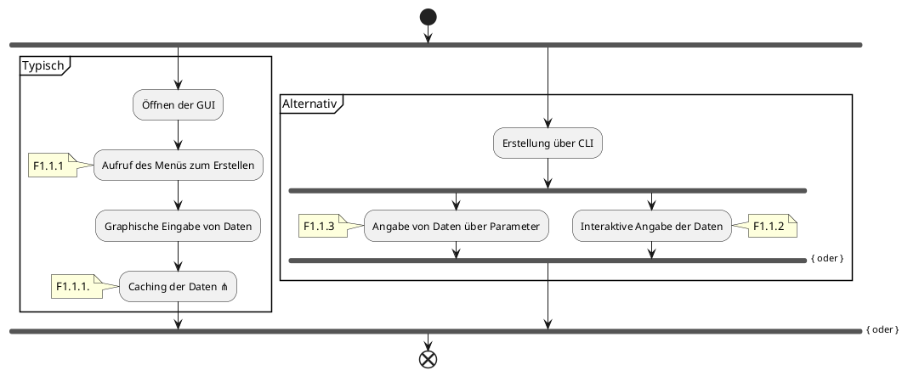

### U1.2 Metadaten bearbeiten

| Schritt                         | Iteration |     |
| ------------------------------- | --------- | --- |
| Nummer                          | 1         | 1.2    |
| Paket                           | 2         | P1    |
| Autor                           | 1         |     |
| Version                         | 1         | 0.4    |
| Kurzbeschreibung                | 1         | Der Nutzer kann die Metadaten eines Projektes bearbeiten.    |
| Beteiligte Akteure              | 1         | Nutzer    |
| Fachverantwortlicher            | 1         |     |
| Referenzen                      | 2         | Dateiformat Doku     |
| Vorbedingungen                  | 2         | Es muss eine Manifestdatei existieren die bearbeitet werden kann.     |
| Nachbedingungen                 | 2         | Die angepasste Manifestdatei wird gespeichert. Wurde die Datei über die GUI verändert, werden die Änderungen gecached    |
| Typischer Ablauf                | 2         |  s. Ablaufdiagramm      |
| Alternative Abläufe             | 3         |  s. Ablaufdiagramm                                                          |
| Kritikalität                    | 3         |  1   |
| Verknüpfungen                   | 2         | Bei GUI: 3.1, 3.2   |
| Funktionale Anforderungen       | 4         | F0.1.1, F1.2.1, F1.2.2    |
| Nicht-funktionale Anforderungen | 4         |     |

#### UseCase Diagramm

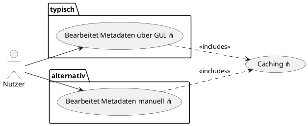

#### Ablaufdiagramme

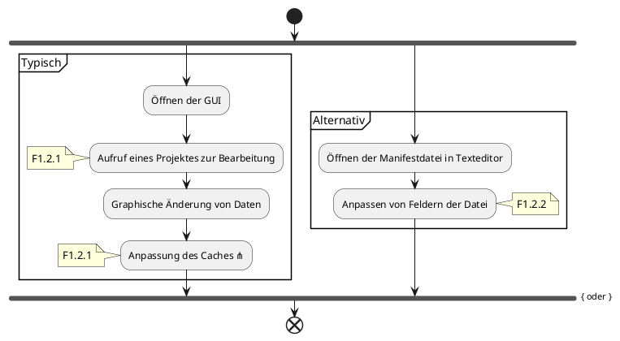

### U1.3 Metadaten löschen

| Schritt                         | Iteration |                                                                                                                                               |
| ------------------------------- | --------- | --------------------------------------------------------------------------------------------------------------------------------------------- |
| Nummer                          | 1         | 1.3                                                                                                                                           |
| Paket                           | 2         | P1                                                                                                                                            |
| Autor                           | 1         |                                                                                                                                               |
| Version                         | 1         | 0.4                                                                                                                                           |
| Kurzbeschreibung                | 1         | Der Nutzer kann die Metadaten für ein Projekt löschen                                                                                         |
| Beteiligte Akteure              | 1         | Nutzer                                                                                                                                        |
| Fachverantwortlicher            | 1         |                                                                                                                                               |
| Referenzen                      | 2         |                                                                                                                                               |
| Vorbedingungen                  | 2         | Es existiert eine valide Manifestdatei die gelöscht werden kann                                                                               |
| Nachbedingungen                 | 2         | Es existiert keine Manifestdatei mehr. Bei manueller Löschung wird der Cache im nachhinein, beim nächsten Starten der Anwendung aktualisiert. |
| Typischer Ablauf                | 2         |  s. Ablaufdiagramm      |
| Alternative Abläufe             | 3         |  s. Ablaufdiagramm                                                          |
| Kritikalität                    | 3         | 1                                                                                                                                             |
| Verknüpfungen                   | 2         | Beim löschen über die Anwendung UseCase 3.1                                                                                                   |
| Funktionale Anforderungen       | 4         | F1.3.1, F1.3.2                                                                                                                                              |
| Nicht-funktionale Anforderungen | 4         |                                                                                                                                               |

#### UseCase Diagramm

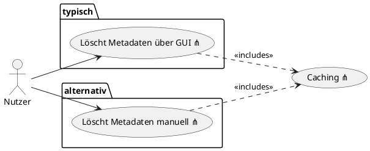

#### Ablaufdiagramme

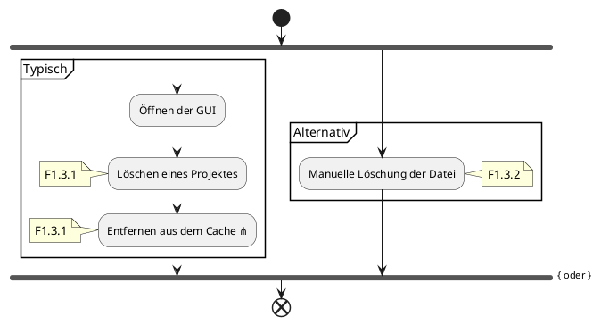

## Paket 2

### U2.1 Manifeste rekursiv auffinden

| Schritt                         | Iteration |     |
| ------------------------------- | --------- | --- |
| Nummer                          | 1         | 2.1    |
| Paket                           | 2         | P2    |
| Autor                           | 1         |     |
| Version                         | 1         |  0.4   |
| Kurzbeschreibung                | 1         | Die Anwendung ist in der Lage in einem von Nutzer angegeben Verzeichnis, rekursiv nach Manifestdateien zu suchen    |
| Beteiligte Akteure              | 1         | Nutzer, Anwendung (wenn eingerichtet, bei Start)   |
| Fachverantwortlicher            | 1         |     |
| Referenzen                      | 2         |     |
| Vorbedingungen                  | 2         | Der Nutzer gibt mindestens ein Verzeichnis an, welches durchsucht werden soll    |
| Nachbedingungen                 | 2         | Metadaten gefundener Manifestdateien, werden in der Anwendung angezeigt   |
| Typischer Ablauf                | 2         |  s. Ablaufdiagramm      |
| Alternative Abläufe             | 3         |   -                                                       |
| Kritikalität                    | 3         |  2  |
| Verknüpfungen                   | 2         |  UseCase 2.2 bei gefundenen Dateien  |
| Funktionale Anforderungen       | 4         |  F2.1.1 - F2.1.4   |
| Nicht-funktionale Anforderungen | 4         |     |

#### UseCase Diagramm

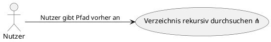

#### Ablaufdiagramm

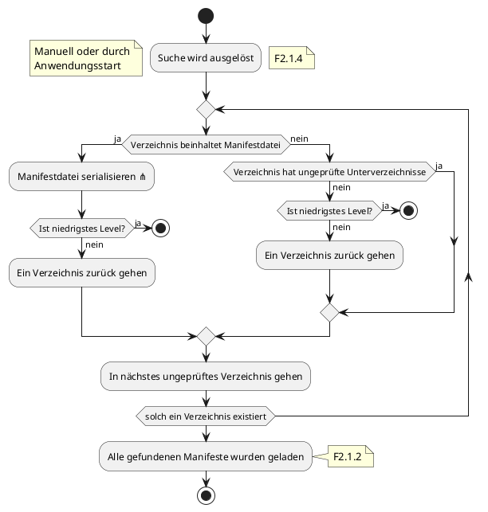

### U2.2 Manifeste serialisieren

| Schritt                         | Iteration |     |
| ------------------------------- | --------- | --- |
| Nummer                          | 1         | 2.2    |
| Paket                           | 2         |  P2   |
| Autor                           | 1         |     |
| Version                         | 1         |  0.4   |
| Kurzbeschreibung                | 1         |  Manifestdatein können eingelesen werden und die darin befindlichen Daten verarbeitet   |
| Beteiligte Akteure              | 1         |  Nutzer, Anwendung (bei rekursiver Suche)   |
| Fachverantwortlicher            | 1         |     |
| Referenzen                      | 2         | Aufbau Manifestdatei    |
| Vorbedingungen                  | 2         | Der Nutzer gibt eine valide Manifestdatei an / Eine valide Manifestdatei wurde gefunden    |
| Nachbedingungen                 | 2         | Die eingelesen Daten sind in der Anwendung sichtbar und werden gecached    |
| Typischer Ablauf                | 2         |  s. Ablaufdiagramm      |
| Alternative Abläufe             | 3         |  s. Ablaufdiagramm                                                          |
| Kritikalität                    | 3         | 0    |
| Verknüpfungen                   | 2         | UseCase 2.1, UseCase 3.1    |
| Funktionale Anforderungen       | 4         | F0.1.1, F2.2.1    |
| Nicht-funktionale Anforderungen | 4         |     |

#### UseCase Diagramm

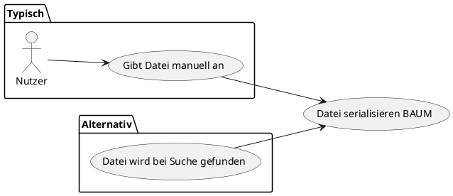

#### Ablaufdiagramm

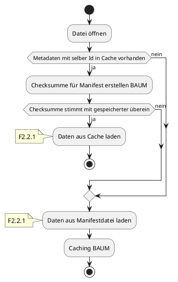

## Paket 3

### U3.1 Daten cachen

| Schritt                         | Iteration |     |
| ------------------------------- | --------- | --- |
| Nummer                          | 1         | 3.1    |
| Paket                           | 2         |  P3   |
| Autor                           | 1         |     |
| Version                         | 1         |   0.4  |
| Kurzbeschreibung                | 1         | Metadaten können in einer lokalen Datenbank gecached werden um eine responsivere Anwendung zu ermöglichen    |
| Beteiligte Akteure              | 1         | Anwendung    |
| Fachverantwortlicher            | 1         |     |
| Referenzen                      | 2         | Sqlite    |
| Vorbedingungen                  | 2         | Manifestdateien sind/werden über die graphische Angewenden eingelesen |
| Nachbedingungen                 | 2         | In der Datenbanktabelle existieren Einträge für die Metadaten einzelner Projekte    |
| Typischer Ablauf                | 2         |  s. Ablaufdiagramm      |
| Alternative Abläufe             | 3         |  s. Ablaufdiagramm                                                          |
| Kritikalität                    | 3         | 3    |
| Verknüpfungen                   | 2         | U1.1, U1.2, U1.3, U2.1, U2.2, U3.2    |
| Funktionale Anforderungen       | 4         | F3.1.1 - F3.1.3    |
| Nicht-funktionale Anforderungen | 4         | N1.1, N2.5    |

#### Usecase Diagramm

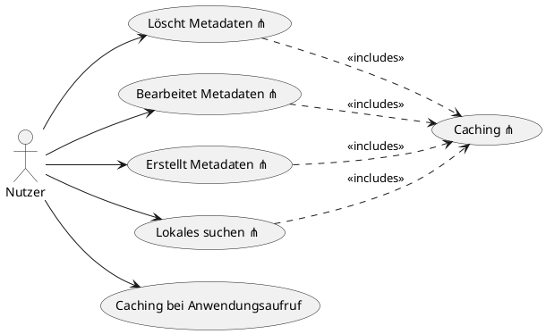

#### Ablaufdiagramme

##### Caching bei Anwendungsaufruf

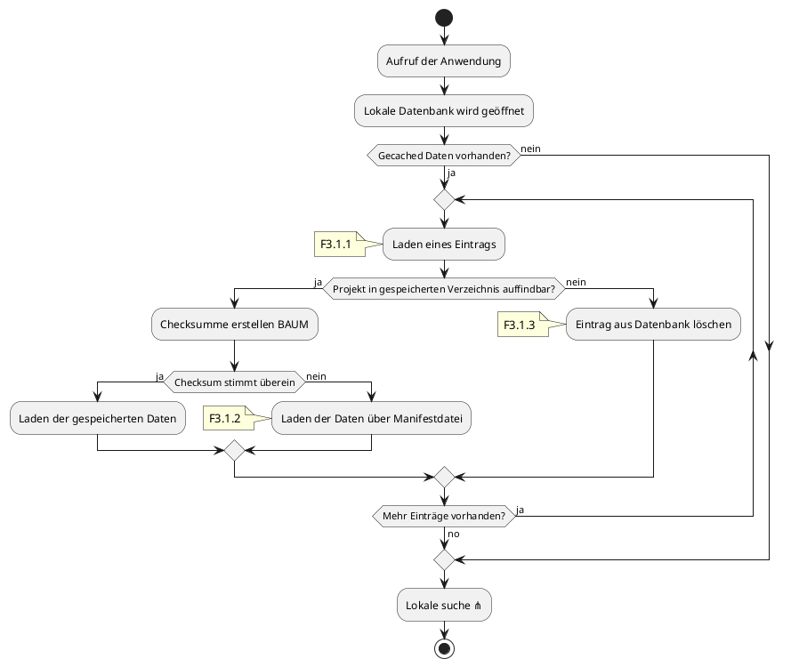

##### Verfeinerung für Lokales Suchen

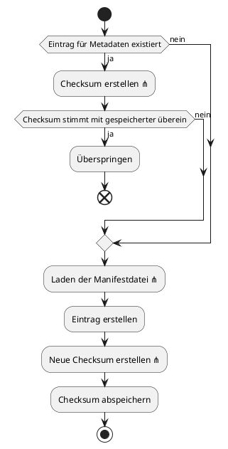

##### Verfeinerung für Erstellen/Aktualisieren

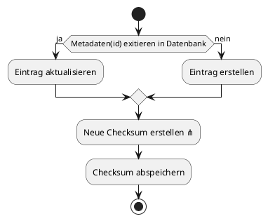

##### Verfeinerung für Entfernen

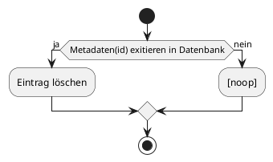

### U3.2 Checksum erstellen

| Name des Use Case               | Iteration |     |
| ------------------------------- | --------- | --- |
| Nummer                          | 1         |  3.2   |
| Paket                           | 2         |  P3   |
| Autor                           | 1         |     |
| Version                         | 1         |  0.4   |
| Kurzbeschreibung                | 1         |  Für Manifestdateien wird eine Checksum erstellt, welche dazu genutzt werden kann Änderungen zu erkennen   |
| Beteiligte Akteure              | 1         | Anwendung    |
| Fachverantwortlicher            | 1         |     |
| Referenzen                      | 2         | Was auch immer wir dann nutzen    |
| Vorbedingungen                  | 2         | Es wurden die Metadaten von mind. 1 Projekt durch die graphische Anwendung eingelesen    |
| Nachbedingungen                 | 2         | Die Checksum für das relevante Projekt wird in der Datenbank gespeichert   |
| Typischer Ablauf                | 2         | -    |
| Alternative Abläufe             | 3         | -    |
| Kritikalität                    | 3         | 3    |
| Verknüpfungen                   | 2         | U1.1, U1.2, U3.1    |
| Funktionale Anforderungen       | 4         | F3.2.1    |
| Nicht-funktionale Anforderungen | 4         |     |

#### UseCase Diagramm

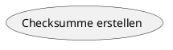

#### Ablaufdiagramm

_Die Art und Weise wie eine Checksumme erstellt wird, wird im Laufe des Projektes determiniert._

### U3.3 Analysen und Statistiken

| Schritt                         | Iteration |     |
| ------------------------------- | --------- | --- |
| Nummer                          | 1         | 3.3    |
| Paket                           | 2         |  P3   |
| Autor                           | 1         |     |
| Version                         | 1         |  0.4   |
| Kurzbeschreibung                | 1         |  Dem Nutzer werden in der graphischen Anwendung verschiedene Statistiken und Analysen zu seinen Projekten bereitgestellt   |
| Beteiligte Akteure              | 1         |  Nuter, Anwendung   |
| Fachverantwortlicher            | 1         |     |
| Referenzen                      | 2         |     |
| Vorbedingungen                  | 2         | Es existiert mindestens ein Projekt dessen Metadaten über die graphische Anwendung serialisert wurden    |
| Nachbedingungen                 | 2         | Der Nutzer kann die bereitgestellen Statistiken in der graphischen Anwendung einsehen    |
| Typischer Ablauf                | 2         |  s. Ablaufdiagramm      |
| Alternative Abläufe             | 3         | -    |
| Kritikalität                    | 3         | 3    |
| Verknüpfungen                   | 2         |     |
| Funktionale Anforderungen       | 4         | F3.3.1    |
| Nicht-funktionale Anforderungen | 4         |     |

#### UseCase Diagramm

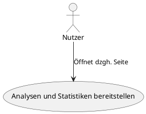

#### Ablaufdiagramm

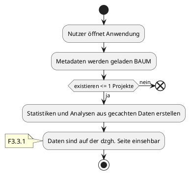

### U3.4

| Schritt                         | Iteration |     |
| ------------------------------- | --------- | --- |
| Nummer                          | 1         | 3.4    |
| Paket                           | 2         | P3    |
| Autor                           | 1         |     |
| Version                         | 1         | 0.4    |
| Kurzbeschreibung                | 1         | Der Nutzer kann seine Projekte nach verschiedenen Eigenschaften suchen bzw. filtern    |
| Beteiligte Akteure              | 1         |  Nutzer   |
| Fachverantwortlicher            | 1         |     |
| Referenzen                      | 2         |     |
| Vorbedingungen                  | 2         | Es existiert mind. 1 Projekt dessen Metadaten über die graphische Anwendung eingelesen wurden    |
| Nachbedingungen                 | 2         | Dem Nutzer werden die Projekte angezeigt, die den gegebenen Bedingungen entsprechen    |
| Typischer Ablauf                | 2         |  s. Ablaufdiagramm      |
| Alternative Abläufe             | 3         |  -   |
| Kritikalität                    | 3         |  3   |
| Verknüpfungen                   | 2         |  -   |
| Funktionale Anforderungen       | 4         |  F3.4.1   |
| Nicht-funktionale Anforderungen | 4         |     |

#### UseCase Diagramm

#### Ablaufdiagramm

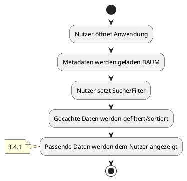

# Requirements

## Funktionale Requirements

F0.1.1: Die Manifestdateien müssen von Menschen, als auch von Maschinen lesbar sein.

F1.1.1: Der Nutzer muss über die graphische Anwendung eine Manifestdatei erstellen können. Hierbei werden die Daten in einer Datenbank gecached.

F1.1.2: Der Nutzer muss über eine interaktive Konsolenanwendung eine neue Manifestdatei erstellen können.

F1.1.3: Der Nutzer wird über die Konsolenanwendung zu Skriptingzwecken auch mithilfe von Parametern und einem nicht interaktiven Modus eine Manifestdatei erstellen können.

F1.1.4: Eine, über die Konsolenanwendung erstellte, Datei muss in der graphischen Anwendung geladen werden können und wird hier dann auch in der Datenbank gecached.

F1.2.1: Der Nutzer muss über die graphische Anwendung Metadaten bearbeiten können. Durch die Bearbeitung wird auch der Cache aktualisiert.

F1.2.2: Die Manifestdatei muss manuell durch den Nutzer mit einem Texteditor bearbeitet werden können. Wird diese Datei vorher gecached, wird die graphische Anwendung Änderungen erkennen und diese erneut cachen.

F1.3.1: Der Nutzer muss über die graphische Anwendung Metadaten eines Projektes löschen können. Dies führt zu der Löschung der Manifestdatei und der Löschung des Eintrages in der Datenbank/dem Cache.

F1.3.2: Der Nutzer muss die Manifestdatei löschen können. Wurde diese vorher gecached, wird die graphische Anwendung dies erkenne und entfernt den Eintrag aus der Datenbank.

F2.1.1: Der Nutzer muss in der graphische Oberfläche eine Manifestdatei angeben können, welche dann weiterverarbeitet wird.

F2.1.2: Der Nutzer muss in der graphische Oberfläche einen Pfad angeben können. In diesem Pfad werden rekursiv alle Manifestdateien aufgefunden und weiterverarbeitet.

F2.1.3: Durch den Nutzer angebene Pfade und Dateien müssen persistiert werden.

F2.1.4: Beim Starten der graphischen Anwendung müssen persitierte Pfade und Dateien automatisch durchsucht werden.

F2.2.1: Die graphische Anwendung muss in der Lage sein Manifestdateien zu serialisieren und mit den darin vorhandenen Daten weiterzuarbeiten.

F3.1.1: Beim Aufruf der graphischen Anwendung werden zunächst alle Daten aus dem Cache geladen. Hierbei wird geprüft ob Dateien noch an ihren gegebenen Pfaden existieren und ob die Checksum mit diesen übereinstimmt.

F3.1.2: Hat sich die Checksum einer Datei verändert wird diese erneut serialisiert und der Cache geupdated.

F3.1.3: Existiert eine Datei nicht mehr an ihrem gegebenen Pfad, wird der Eintrag aus dem Cache gelöscht und wird dem Nutzer nicht mehr angezeigt.

F3.2.1: Anhand der Metadaten in jeder Manifestdatei wird eine einzige Checksumme erstellt anhand welcher Änderungen erkennbar sind.

F3.3.1: Anhand der Metadaten aller geladenen Projekte werden beim Programmstart oder auf Wunsch des Nutzers verschiedene Übersichten und Statistiken erstellt, die vom Nutzer eingesehen werden können.

F3.4.1: Der Nutzer wird in der graphischen Oberfläche innerhalb aller geladenen Projekte anhand verschiedener Eigenschaften suchen und filtern.

## Nicht-funktionale Requirements

N1.1: Die Anwendung soll schnellst möglich dem Nutzer nach dem Start zur Bedienung bereit stehen.

N1.2: Die Anwendung soll möglichst responsiv und nutzerfreundlich sein.

N2.2: Die Anwendung muss in den Betriebssystem Microsoft Windows 10, Microsoft Windows 11, und Linux (insb. in Ubuntu und Debian) funktionieren.

N2.3: Die Anwendung soll in Rust und Typscript verfasst sein.

N2.4: Für die Anwendung sollen die Frameworks "Tauri v2.0+" für das Backend und "SvelteKit v2.8+" für das Frontend genutzt werden.

N2.5: Für die Datenbank soll SQLite verwendet werden.

N2.6: Die Anwendung muss für die Prozessorarchitektur x86_64 ausgelegt sein.

N3.1: Das Projekt muss bis zum Ende der Theoriephase im Quartal 1 im Jahr 2025 abgeschlossen sein. Ein exaktes Datum hierfür folgt.

N3.2: Alle Meetings müssen in Meetingprotokollen festgehalten werden.

N3.3: Es muss eine Entwicklerdokumentation angefertigt werden.
