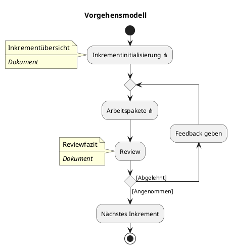
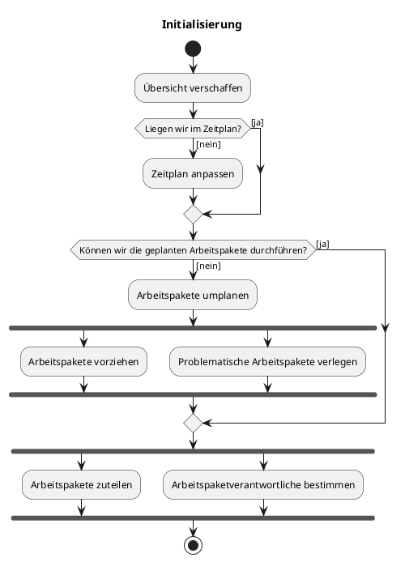
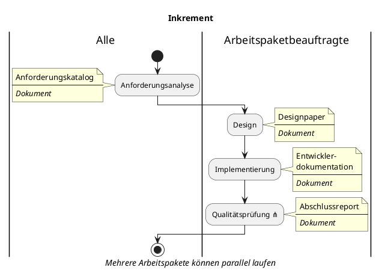
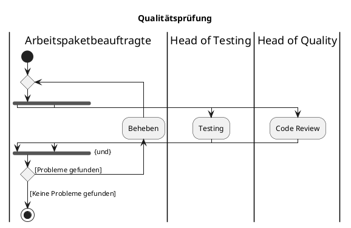

# Entwicklungsplan

---

### Übersicht

**Projekt**: Projekt Episko \
&nbsp;&nbsp;&nbsp;&nbsp;_Iteration_: 0 \
&nbsp;&nbsp;&nbsp;&nbsp;_Arbeitspaket_: Projektentwicklungsplan \
**Autor**: Maximilian Rodler \
**Datum**: 11.10.2024 \
**Zuletzt geändert**: \
&nbsp;&nbsp;&nbsp;&nbsp;_von_: Maximilian Rodler \
&nbsp;&nbsp;&nbsp;&nbsp;_am_: 11.10.2024 \
**Version**: 1 \
**Letzte Freigabe**: \
&nbsp;&nbsp;&nbsp;&nbsp;_durch_: Simon Blum \
&nbsp;&nbsp;&nbsp;&nbsp;_am_: 11.10.2024

### Changelog

| Datum      | Verfasser         | Kurzbeschreibung                           |
|------------|-------------------|--------------------------------------------|
| 01.10.2024 | Maximilian Rodler | Vorgehensmodell entwickeln uns ausarbeiten |
| 12.10.2024 | Simon Blum        | Diagramme hinzufügen                       |

### Distribution List

- Simon Blum <simon21.blum@gmail.com>
- Ben Oeckl <ben@oeckl.com>
- Maximilian Rodler <maximilianreinerrodler@gmail.com>
- Paul Stöckle <paul.stoeckle@t-online.de>

---

## Vorgehensmodell

Gearbeitet wird primär Iterativ-Inkrementell:

- Zu Beginn des Projektes werden Inkremente (Meilensteine) geplant.
- Dieses Inkrement kann ein oder mehrere Arbeitspakete beinhalten.

Diese Iterativ-Inkrementelle Arbeitsweise beinhaltet agile Elemente:

- Es gibt wöchentliche Meetings zur Absprache.
- Hier können die Ziele/der Zeitraum eines Inkrements angepasst werden, falls nötig.
- Es können parallel mehrere Arbeitspakete in einem Inkrement durchgeführt werden.

Eine genauere Übersicht kann unter "" gefunden werden.

## Teamzusammensetzung

- Simon Blum, TIT23
- Paul Stöckle, TIT23
- Maximilian Rodler, TIT23
- Ben Oeckl, TIT23

## Rollen

Projektmanager - Maximilian Rodler \
Head of Development - Paul Stöckle \
Head of Quality & Operations - Simon Blum \
Head of Testing & Integrations - Ben Oeckl

## Verantwortlichkeiten und Aufgaben

| Aufgabe                                                          | Verantwortliche                 |
|------------------------------------------------------------------|---------------------------------|
| Protokollierung                                                  | Maximilian Rodler               |
| Erstellung und Verwaltung von Arbeitspaketen/Meilensteine        | Maximilian Rodler, Paul Stöckle |
| Einhaltung und Planung von Deadlines                             | Maximilian Rodler               |
| Sicherung von Codequalität                                       | Simon Blum                      |
| Sicherung von Dokumentenqualität                                 | Simon Blum                      |
| Erstellung und Verwaltung von CI/CD Pipelines                    | Ben Oeckl, Simon Blum           |
| Übersichtlichkeit und Struktur der Organisation                  | Ben Oeckl, Simon Blum           |
| Testen der Funktionalität                                        | Ben Oeckl                       |
| Koordinierung und Verantwortlichkeit für Arbeiten am Source Code | Paul Stöckle                    |

## Dokumente

Im Laufe des Prozesses werden diverse Dokumente erstellt.

### Meetings

Zu jedem Meeting wird ein Dokument erstellt welches die folgenden Informationen beinhaltet:

- Datum, Ort
- Teilnehmer
- Moderation
- Diskussionspunkte
- Ergebnisse
- Folgeaktionen
- _Optional:_ Hinweis auf relevante Dokumente
- _Optional:_ Notizen

### Inkremente

Im Rahmen eines Inkrementes werden folgende Dokumente erstellt:

- Inkrementübersicht
    - Beinhaltet Arbeitspakete und Verantwortliche des Projektes
- Reviewfazit
    - Dieses wird bei mehreren Reviews erweitert
- Dokumente der/des Arbeitspaket/es:
    - Anforderungskatalog
    - Designpaper
    - Entwicklerdokumentation
    - Abschlussreport
    - _Wird das Arbeitspaket in einer Iteration überarbeitet, werden diese
      Dokumente ergänzt!_

## Diagramme

---

---

---

