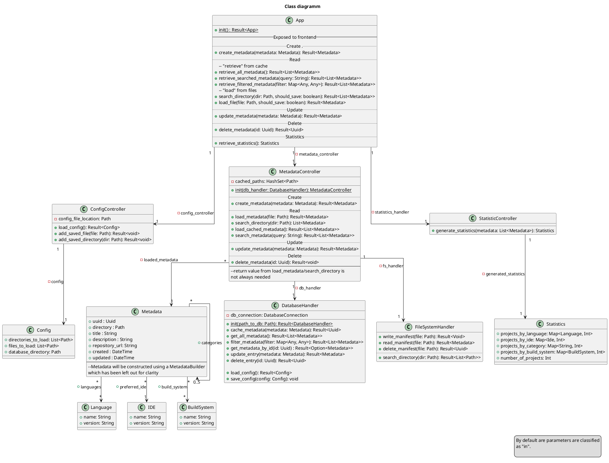
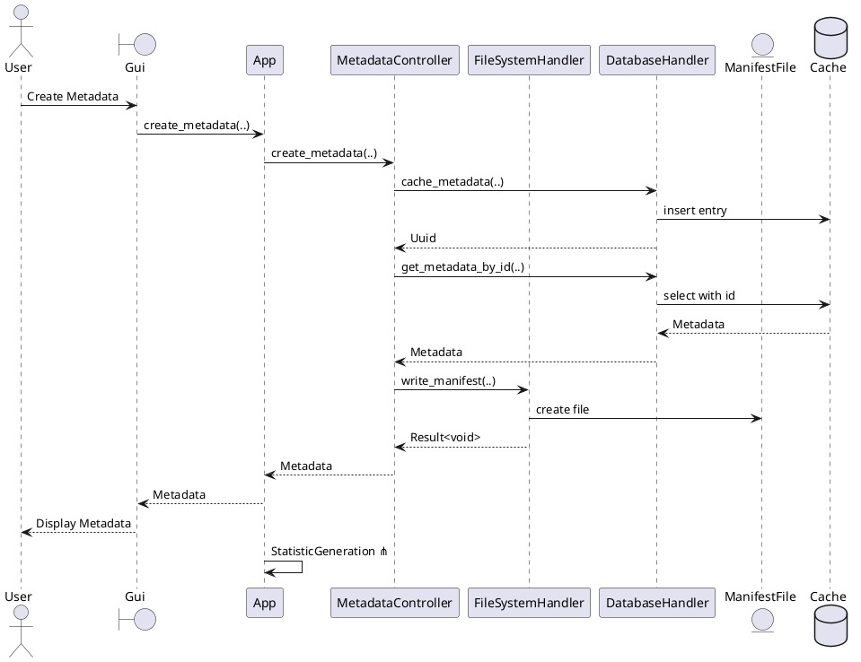
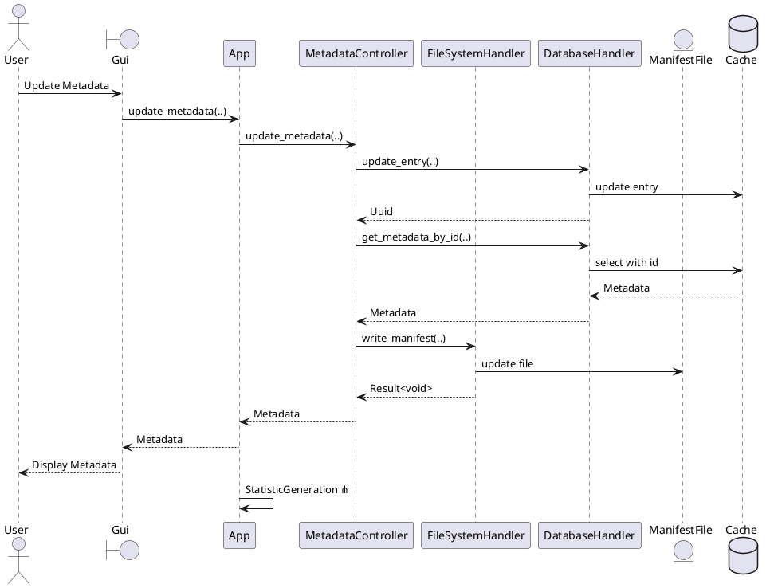
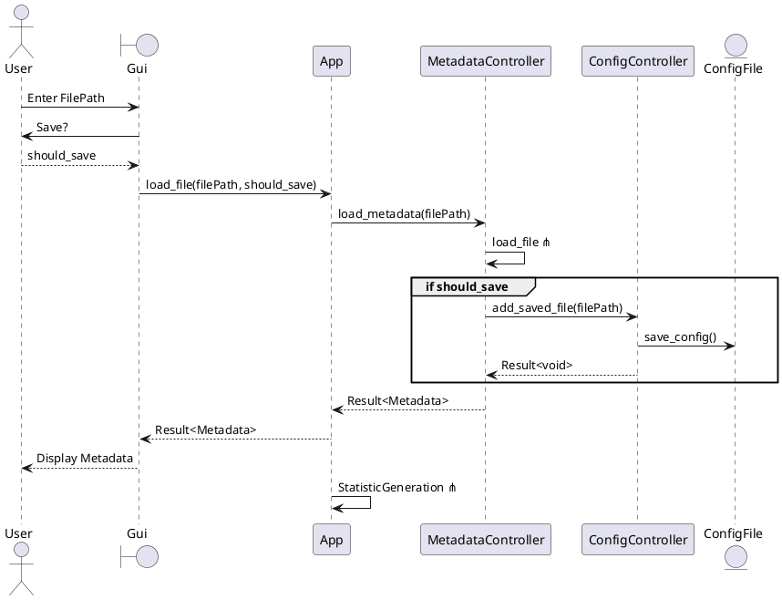
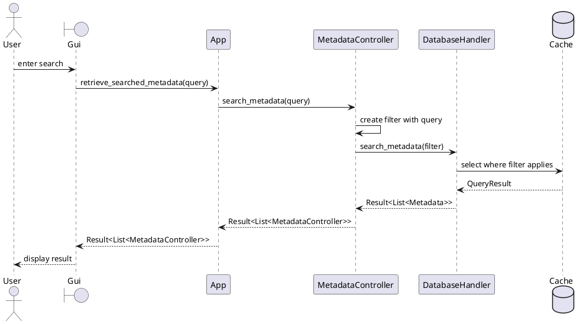
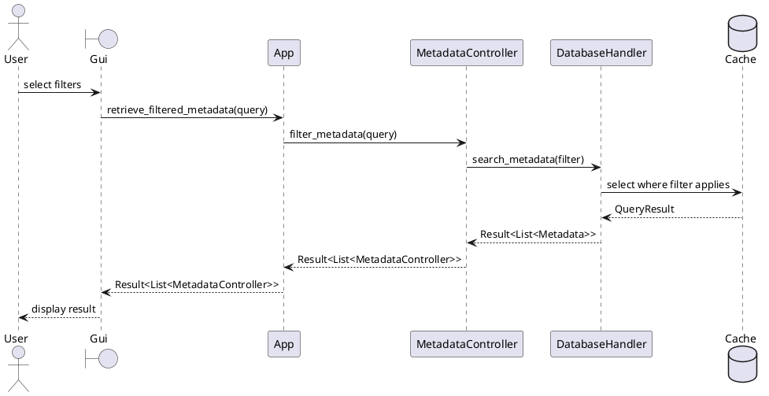
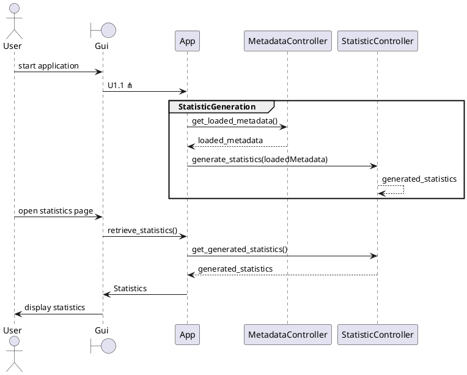

# Grobdesign

---

### Übersicht

**Projekt**: Projekt Episkos \
&nbsp;&nbsp;&nbsp;&nbsp;_Iteration_: 4 \
&nbsp;&nbsp;&nbsp;&nbsp;_Arbeitspaket_: - \
**Autor**: Simon Blum, Ben Oeckl, Paul Stöckle\
**Datum**: 05.12.2024\
**Zuletzt geändert**: \
&nbsp;&nbsp;&nbsp;&nbsp;_von_: \
&nbsp;&nbsp;&nbsp;&nbsp;_am_: \
**Version**: 1 \
**Prüfer**: Max Rodler\
**Letzte Freigabe**: \
&nbsp;&nbsp;&nbsp;&nbsp;_durch_: Max Rodler\
&nbsp;&nbsp;&nbsp;&nbsp;_am_: 05.12.2024 

### Changelog

| Datum       | Verfasser  | Kurzbeschreibung                  |
|-------------|------------| --------------------------------- |
| 05.12..2024 | Simon Blum | Initiales Erstellen und Verfassen |

### Distribution List

- Simon Blum <simon21.blum@gmail.com>
- Ben Oeckl <ben@oeckl.com>
- Maximilian Rodler <maximilianreinerrodler@gmail.com>
- Paul Stöckle <paul.stoeckle@t-online.de>

---

## Klassendiagramm

> **Anmerkung**: \
> Während das Klassendiagramm als Grundlage zur Implementierung sicherlich eine Stütze stellen kann,
> sollte trotzdem beachtet werden, dass Rust als Sprache sich nur begrenzt zur Objektorientierung anbietet
> und einiges durch leichte Veränderung idiomatischer, sauberer und effizienter implementiert werden kann
> und sollte.
> Hierfür sollen bei auftretenden Fällen, entsprechende Anmerkungen im Klassendiagramm angefügt werden.

## Sequenzdiagramme

Die Sequenzdiagramme basieren auf den Use-Cases und sind dementsprechend aufgeteilt.

### U1.1

### U1.2

### U1.3

### U1.4

### U2.1

### U2.2

### U3.1

### U3.2

### U3.3

## Anforderungstracing

### Struktur

Die Anforderungsverfolgung ist aktuell nach folgender Struktur aufgebaut:

[Use Case] -> [Anforderung] -> [Klassenattribut]

In Zukunft soll diese noch in ein passendes Diagramm überführt werden.

### Verfolgung

UC1.1 -> FA1.1.1 -> App.retrieve_all_metadata()

UC1.1 -> FA1.1.2 -> FileSystemHandler.read_manifest()

UC1.2 -> FA1.2.1 -> App.create_metadata(), MetadataController.create_metadata(), DatabaseHandler.update_entry() FileSystemHandler.write_manifest()

UC1.2 -> FA1.2.2 -> FileSystemHandler.write_manifest()

UC1.2 -> FA1.2.3 -> DatabaseHandler.cache_metadata()

UC1.3 -> FA1.3.1 -> App.update_metadata()

UC1.3 -> FA1.3.2 -> MetadataController.update_metadata(), DatabaseHandler.update_entry()

UC1.3 -> FA1.3.3 -> MetadataController.load_metadata(), MetadataController.search_directory(), FileSystemHandler.read_manifest()

UC1.4 -> FA1.4.1 -> App.delete_metadata, MetadataController.delete_metadata, FileSystemHandler.delete_manifest()

UC1.4 -> FA1.4.2 -> DatabaseHandler.delete_entry(),

UC1.4 -> FA1.4.3 -> Metadata_Controller.load_metadata(), MetadataController.search_directory(), MetadataController.delete_metadata, DatabaseHandler.delete_entry()

UC2.1 -> FA2.1.1 -> App.loadFile, ConfigController.add_saved_file()

UC2.1 -> FA2.1.2 -> Siehe FA1.1.2

UC2.1 -> FA2.1.3 -> siehe FA1.2.3

UC2.1 -> FA2.1.4 -> App.search_directory(), ConfigController.add_saved_directory()

UC2.1 -> FA2.1.5 ->  MetadataController.search_directory(), FileSystemHandler.search_directory()

UC2.2 -> FA2.2.1 -> Siehe FA2.1.4

UC2.2 -> FA2.2.2 -> Siehe FA2.1.5

UC2.2 -> FA2.2.3 -> MetadataController.load_metadata(), MetadataController.update_metadata(), DatabaseHandler.update_entry()

UC2.2 -> FA2.2.4 -> Siehe FA2.1.5

UC2.2 -> FA2.2.5 -> Siehe FA2.1.5

UC3.1 -> FA3.1.1 -> MetadataController.search_metadata()

UC3.1 -> FA3.1.2 -> App.retrieve_searched_metadata() - Input der Methode stellt Nutzereingabe da

UC3.1 -> FA3.1.3 -> App.retrieve_searched_metadata() - Output Methode wird nutzer angezeigt

UC3.2 -> FA3.2.1 -> MetadataController.filter_metadata()

UC3.2 -> FA3.2.2 -> App.retrieve_filtered_metadata() - Input der Methode stellt Nutzereingabe da

UC3.2 -> FA3.2.3 -> App.retrieve_filtered_metadata() - Output Methode wird nutzer angezeigt

UC3.3 -> FA3.3.1 -> StatisticsController.generate_statistics()

UC3.3 -> FA3.3.2 -> StatisticsController.retrieve_statistics()
