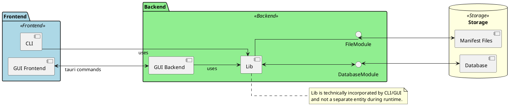

# Inkrement Initialisierung X

---

### Übersicht

**Projekt**: Projekt Episkos \
&nbsp;&nbsp;&nbsp;&nbsp;_Inkrement_: -\
&nbsp;&nbsp;&nbsp;&nbsp;_Arbeitspaket_: -\
**Autor**: \
**Datum**: \
**Zuletzt geändert**: \
&nbsp;&nbsp;&nbsp;&nbsp;_von_: \
&nbsp;&nbsp;&nbsp;&nbsp;_am_: \
**Version**: 1 \
**Prüfer**: \
**Letzte Freigabe**: \
&nbsp;&nbsp;&nbsp;&nbsp;_durch_: \
&nbsp;&nbsp;&nbsp;&nbsp;_am_: 

### Changelog

| Datum      | Verfasser | Kurzbeschreibung                  |
| ---------- | --------- | --------------------------------- |
| 27.01.2025 | Simon Blum  | Initiales Erstellen und Verfassen |
| 03.02.2025 | Simon Blum | Hinzufügen von Datenbank Modul |

### Distribution List

- Simon Blum <simon21.blum@gmail.com>
- Ben Oeckl <ben@oeckl.com>
- Maximilian Rodler <maximilianreinerrodler@gmail.com>
- Paul Stöckle <paul.stoeckle@t-online.de>

---

## Übersicht Systemarchitektur
- Aufgeteilt in Lib, Cli, Gui
- Klassendiagramme/Sequenzdiagramme in Grobdesign
- Responsiblilites, wer macht was, was ist wo? 
- Noch ein kleines Diagramm zu Komponentenübersicht?!

## Module
Funktionen - Schnitstellen - Datenmodelle
### Datenbank - Persitenter Cache
--> Datei
### Lib
--> Datei(en)
### Gui
-> Datei(en)
### Cli
--> Datei(en)

## Technische Spezifikationen
### Sprachen/Technologien
- Rust
- Sqlite
- toml
- TypeScript
- Html
- (CSS)
### Frameworks
- Tauri
- SvelteKit
### Libraries
#### Backend/Lib
- Sqlx
- Tokio

#### Gui Backend
- Tokio

#### Gui Frontend
- ShadCN
- Tailwindcss

#### Cli
- Clap

### Algorithmen
- Sha256 Hashing (verwendet, implementierung durch lib)

## Qualitäts- und Sicherheitsaspekte
### Qualität
- Tests in Front- und Backend
- Ci/Cd
    - Automatisches Testen
    - Prüfen, dass gebaut werden kann
- Release Steps
    - feat Branch während Inkrement
    - alpha Branch während nächstem Inkrement
    - beta/next bis nächster Release
### Performance
Performance wird in erster Stelle durch die Verwendung von Rust und
performanten Frameworks gesichert ........

### Sicherheit
Für die Anwendung wurden die Manifest Dateien als primäre mögliche Angrifsstelle
identifiziert, da diese in öffentlichen Repositories liegen können und
direkt von dem Program verarbeitet werden.
Vorallem wäre hier in der Theorie eine Sql Injektion durch bösartig gesetzte
Schlüssel denkbar. Um dies zu verhindern wird die Library [sqlx]() verwendet.
- Memory Safety und so durch Rust...
- Sonst keine Netzanbindung

