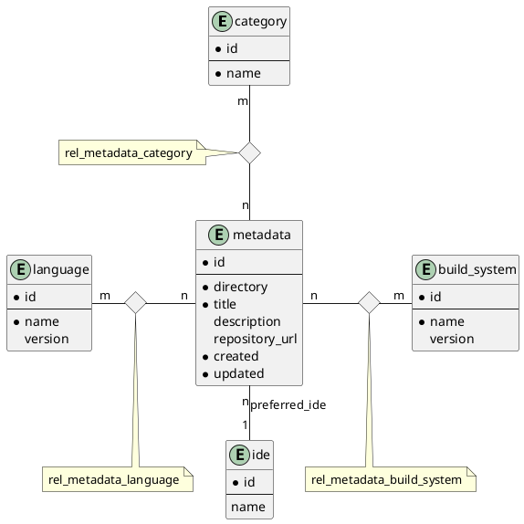

Datenbank
---------

Die Datenbank dient im Kontext des Projektes als persistenter Cache. Hier werden Metadaten und alle dazugehörigen Relationen zwichengespeichert um ein performantes und responsives nutzen der Gui Anwendung zu ermöglichen.

Datenbanktechnologie
--------------------

Als Datenbank wird sqlite als lokale Lösung genutzt. Diese ist simpel performant und erfüllt somit alle unsere Anforderungen an eine Speicherlösung.

ERM Diagramm
------------

Datadictionary
--------------

### metadata

| Attribut       | Datentyp | Länge    | Nullable | Default | Key          | Beschreibung                               |
|----------------|----------|----------|----------|---------|--------------|--------------------------------------------|
| id             | BLOB     | 128bit   | Nein     | \-      | Primary      | UUIDv4                                     |
| directory      | TEXT     | variabel | Nein     | \-      | \-           | Lokales Verzeichnis des Manifestes         |
| title          | TEXT     | variabel | Nein     | \-      | \-           | Titel des Projektes                        |
| description    | TEXT     | variabel | Ja       | NULL    | \-           | Beschreibung                               |
| preferred_ide  | BLOB     | variabel | Ja       | NULL    | Foreign(Ide) | Id des bevorzugten Code Editor/Ide         |
| repository_url | TEXT     | variabel | Ja       | NULL    | \-           | URL des remote git repositorys             |
| created        | TEXT     | variabel | Nein     | \-      | \-           | Erstellzeipunkt in ISO 8601 Format         |
| updated        | TEXT     | variabel | Nein     | \-      | \-           | Aktualisierungszeipunkt in ISO 8601 Format |

### category

| Attribut | Datentyp | Länge    | Nullable | Default | Key     | Beschreibung          |
|----------|----------|----------|----------|---------|---------|-----------------------|
| id       | BLOB     | variabel | Nein     | \-      | Primary | Id basierend auf Hash |
| name     | TEXT     | variabel | Nein     | \-      | \-      | Name der Kategorie    |

### language

| Attribut | Datentyp | Länge    | Nullable | Default | Key     | Beschreibung                   |
|----------|----------|----------|----------|---------|---------|--------------------------------|
| id       | BLOB     | variabel | Nein     | \-      | Primary | Id basierend auf Hash          |
| name     | TEXT     | variabel | Nein     | \-      | \-      | Name der Programmiersprache    |
| version  | TEXT     | variabel | Nein     | \-      | \-      | Version der Programmiersprache |

### build_system

| Attribut | Datentyp | Länge    | Nullable | Default | Key     | Beschreibung              |
|----------|----------|----------|----------|---------|---------|---------------------------|
| id       | BLOB     | variabel | Nein     | \-      | Primary | Id basierend auf Hash     |
| name     | TEXT     | variabel | Nein     | \-      | \-      | Name des Build Systems    |
| version  | TEXT     | variabel | Nein     | \-      | \-      | Version des Build Systems |

### ide

| Attribut | Datentyp | Länge    | Nullable | Default | Key     | Beschreibung              |
|----------|----------|----------|----------|---------|---------|---------------------------|
| id       | BLOB     | variabel | Nein     | \-      | Primary | Id basierend auf Hash     |
| name     | TEXT     | variabel | Nein     | \-      | \-      | Name des Code Editors/Ide |

### rel_metadata_category

| Attribut    | Datentyp | Länge    | Nullable | Default | Key                         | Beschreibung |
|-------------|----------|----------|----------|---------|-----------------------------|--------------|
| metadata_id | BLOB     | variabel | Nein     | \-      | Primary + Foreign(metadata) | Metadata Id  |
| category_id | BLOB     | variabel | Nein     | \-      | Primary + Foreign(category) | Category Id  |

### rel_metadata_language

| Attribut    | Datentyp | Länge    | Nullable | Default | Key                         | Beschreibung |
|-------------|----------|----------|----------|---------|-----------------------------|--------------|
| metadata_id | BLOB     | variabel | Nein     | \-      | Primary + Foreign(metadata) | Metadata Id  |
| language_id | BLOB     | variabel | Nein     | \-      | Primary + Foreign(language) | Language Id  |

### rel_metadata_build_system

| Attribut        | Datentyp | Länge    | Nullable | Default | Key                             | Beschreibung    |
|-----------------|----------|----------|----------|---------|---------------------------------|-----------------|
| metadata_id     | BLOB     | variabel | Nein     | \-      | Primary + Foreign(metadata)     | Metadata Id     |
| build_system_id | BLOB     | variabel | Nein     | \-      | Primary + Foreign(build_system) | Build System Id |
