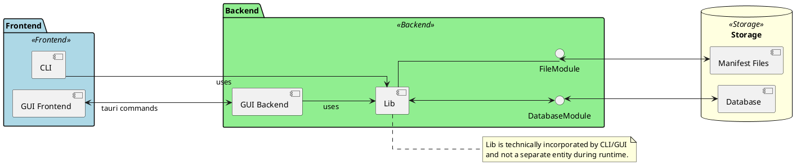

# System Detailed Design

---

### Übersicht

**Projekt**: Projekt Episko \
&nbsp;&nbsp;&nbsp;&nbsp;_Inkrement_: -\
&nbsp;&nbsp;&nbsp;&nbsp;_Arbeitspaket_: -\
**Autor**: Simon Blum\
**Datum**: 27.01.2025\
**Zuletzt geändert**: \
&nbsp;&nbsp;&nbsp;&nbsp;_von_: Simon Blum\
&nbsp;&nbsp;&nbsp;&nbsp;_am_: 07.02.2025\
**Version**: 3 \
**Prüfer**: \
**Letzte Freigabe**: \
&nbsp;&nbsp;&nbsp;&nbsp;_durch_: Max Rodler\
&nbsp;&nbsp;&nbsp;&nbsp;_am_: 04.02.2025

### Changelog

| Datum      | Verfasser    | Kurzbeschreibung                              |
|------------|--------------|-----------------------------------------------|
| 27.01.2025 | Simon Blum   | Initiales Erstellen und Verfassen             |
| 01.02.2025 | Paul Stöckle | Hinzufügen von CLI Modul                      |
| 03.02.2025 | Simon Blum   | Hinzufügen von Datenbank Modul                |
| 07.02.2025 | Simon Blum   | Hinzufügen von Links fürs Wiki                |
| 07.02.2025 | Paul Stöckle | Aktualisierung der CLI Library-Abhängigkeiten |

### Distribution List

- Simon Blum <simon21.blum@gmail.com>
- Ben Oeckl <ben@oeckl.com>
- Maximilian Rodler <maximilianreinerrodler@gmail.com>
- Paul Stöckle <paul.stoeckle@t-online.de>

---

## Übersicht Systemarchitektur

- Aufgeteilt in Lib, Cli, Gui
- Klassendiagramme/Sequenzdiagramme in Grobdesign
- Responsibility, wer macht was, was ist wo?
- Noch ein kleines Diagramm zu Komponentenübersicht?

## Module

Funktionen - Schnittstellen - Datenmodelle

### Backend - Datenbank

- [Mehr …](database.md)

### Backend - Lib

- [Mehr …](lib.md)

### Backend - Derive Macro

- [Mehr …](derive_macro.md)

### Backend - Cli

- [Mehr …](gui_backend.md)

### Frontend- Gui

- [Mehr …](gui_frontend.md)

### Frontend - Cli

- [Mehr …](cli.md)

## Technische Spezifikationen

### Sprachen/Technologien

- Rust
- Sqlite
- toml
- TypeScript
- Html
- (CSS)

### Frameworks

- Tauri
- SvelteKit

### Libraries

Verwendet Libraries und ihre Versionen können in den einzelnen
Modulen gefunden werden.

### Algorithmen

- Sha256 Hashing (verwendet, implementierung durch lib)

## Qualitäts- und Sicherheitsaspekte

### Qualität

- Tests in Front- und Backend
- Ci/Cd
    - Automatisches Testen
    - Prüfen, dass gebaut werden kann
- Release Steps
    - feat Branch während Inkrement
    - alpha Branch während nächstem Inkrement
    - beta/next bis nächster Release

### Performance

Performance wird in erster Stelle durch die Verwendung von Rust und
performanten Frameworks gesichert ........

### Sicherheit

Für die Anwendung wurden die Manifest-Dateien als primäre mögliche Angriffsstelle
identifiziert, da diese in öffentlichen Repositories liegen können und
direkt von dem Program verarbeitet werden.
Vor allem wäre hier in der Theorie eine Sql Injektion durch bösartig gesetzte
Schlüssel denkbar. Um dies zu verhindern wird die Library [sqlx]() verwendet.

- Memory Safety und so durch Rust...
- Sonst keine Netzanbindung

